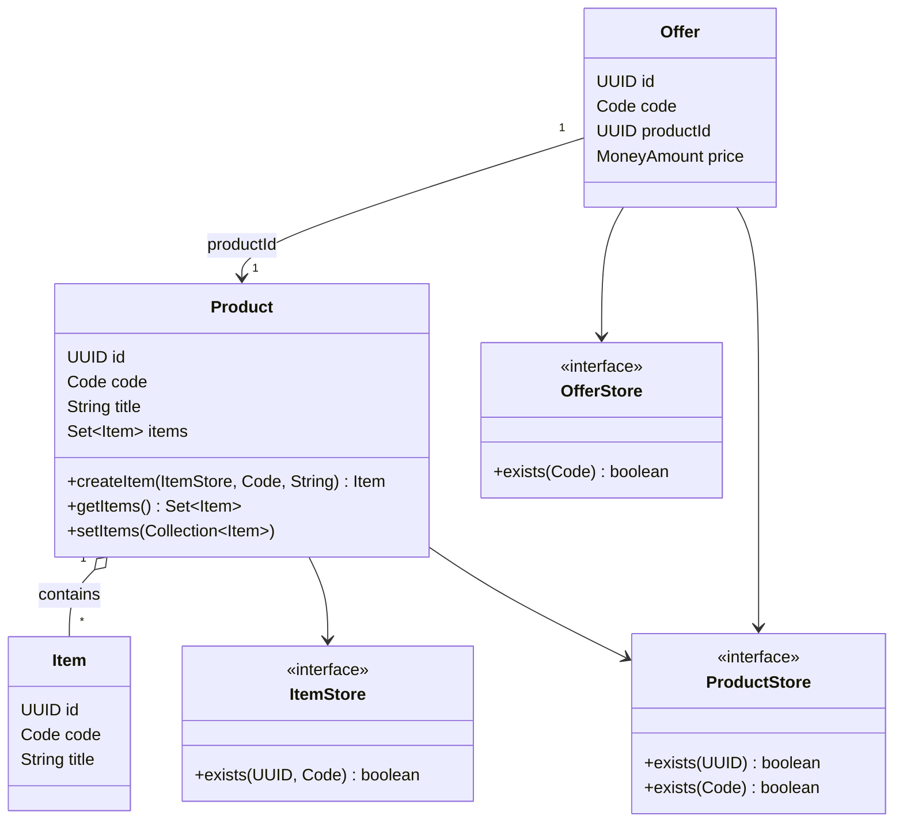

# Product Domain Model

This diagram illustrates the core domain model for the product bounded context, including their relationships and the
interfaces used for data access and existence checks.

```mermaid
classDiagram
    direction TB
    class Product {
        UUID id
        Code code
        String title
        Set~Item~ items
        +createItem(ItemStore, Code, String) Item
        +getItems() Set~Item~
        +setItems(Collection~Item~)
    }

    class Item {
        UUID id
        Code code
        String title
    }

    class Offer {
        UUID id
        Code code
        UUID productId
        MoneyAmount price
    }

    class ProductStore {
        <<interface>>
        +exists(UUID) boolean
        +exists(Code) boolean
    }

    class ItemStore {
        <<interface>>
        +exists(UUID, Code) boolean
    }

    class OfferStore {
        <<interface>>
        +exists(Code) boolean
    }

Product "1" o-- "*" Item: contains
Offer "1" --> "1" Product: productId
Product --> ItemStore
Product --> ProductStore
Offer --> OfferStore
Offer --> ProductStore
```
